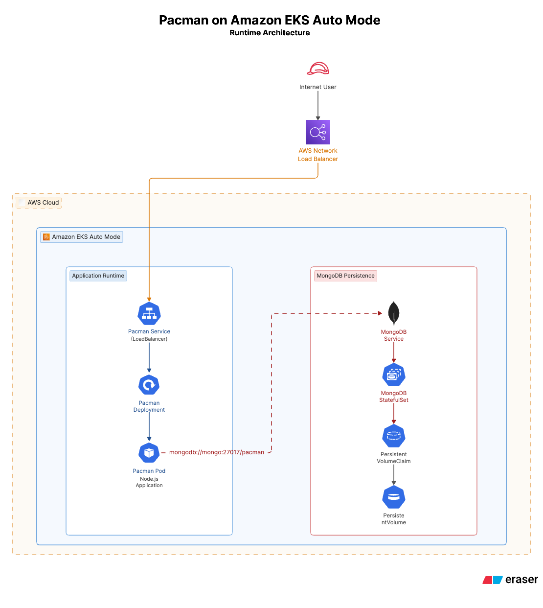
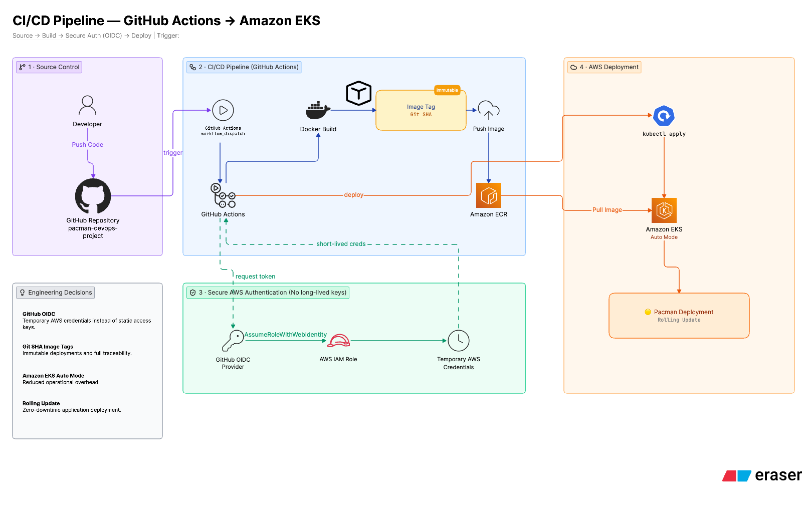
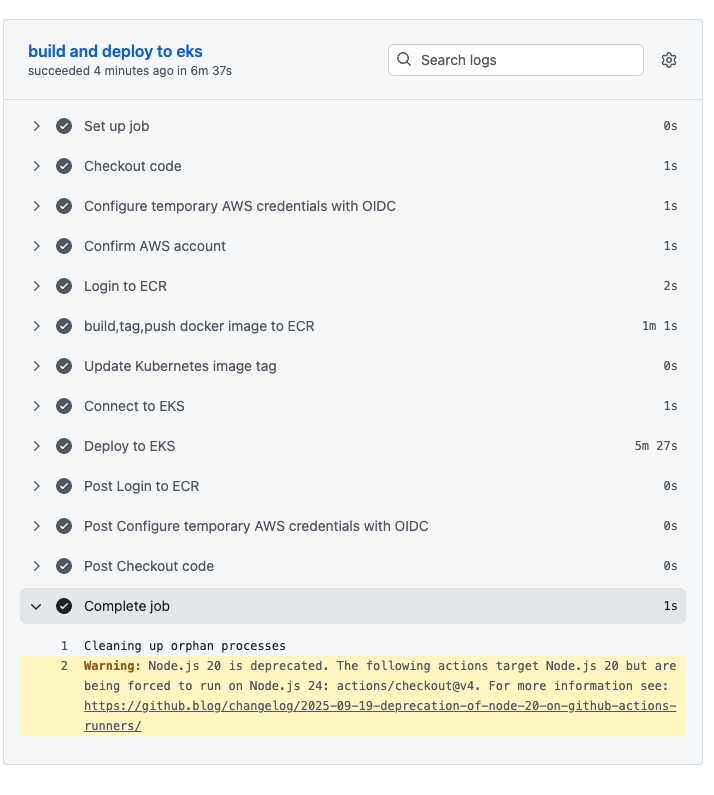
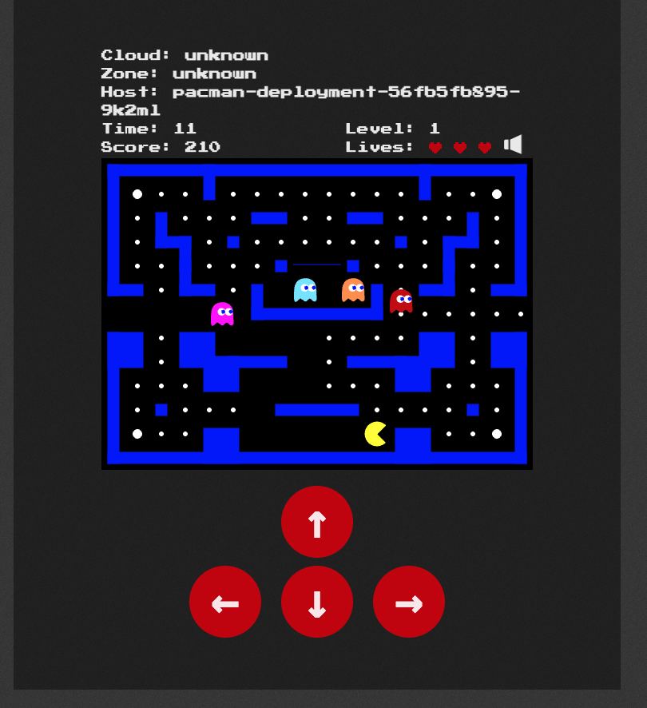

# 🎮 Pac-Man DevOps Project

## 🚀 Technologies


A production-oriented DevOps implementation of the classic **Pac-Man** application deployed on **Amazon EKS Auto Mode** with a secure, fully automated CI/CD pipeline.

---

## 📌 Project Overview

This project demonstrates an end-to-end DevOps workflow for deploying the classic Pac-Man application on **Amazon EKS Auto Mode** using modern cloud-native technologies and AWS services.

The solution includes infrastructure provisioning with **eksctl**, containerization with **Docker**, image management using **Amazon ECR**, Kubernetes orchestration, and a fully automated CI/CD pipeline built with **GitHub Actions**.

To improve security, the deployment pipeline authenticates to AWS using **GitHub OpenID Connect (OIDC)**, eliminating the need for long-lived AWS credentials while following AWS security best practices.

---

# 🏗️ Solution Architecture

The following diagram illustrates the complete production architecture of the project.

It includes GitHub Actions, Amazon ECR, Amazon EKS Auto Mode, the Kubernetes workloads, MongoDB StatefulSet with persistent storage, and the external Network Load Balancer used to expose the application.

<p align="center">
  
</p>

---

# 🔄 CI/CD Pipeline

The following diagram illustrates the complete CI/CD workflow implemented for this project.

Every code change pushed to the **master** branch automatically triggers GitHub Actions to:

- Build the Docker image
- Tag the image using the Git commit SHA
- Push the image to Amazon ECR
- Authenticate to AWS using GitHub OIDC
- Update the running workload on Amazon EKS

<p align="center">
  
</p>

---

# ⭐ Project Highlights

- 🔐 Implemented passwordless AWS authentication using **GitHub OIDC**, eliminating the need for long-lived AWS access keys.
- ☸️ Deployed the application on **Amazon EKS Auto Mode**, leveraging managed Kubernetes infrastructure.
- 🚀 Built a fully automated **CI/CD pipeline** using GitHub Actions.
- 📦 Built, tagged, and pushed Docker images automatically to **Amazon Elastic Container Registry (ECR)**.
- 🏷️ Implemented automatic Docker image versioning using the **Git commit SHA**.
- 💾 Deployed **MongoDB as a StatefulSet** with persistent storage backed by Amazon EBS volumes.
- 🌐 Exposed the application through an **AWS Network Load Balancer (NLB)**.
- ⚙️ Managed the Kubernetes infrastructure using declarative YAML manifests and **eksctl**.
- 🧹 Performed complete AWS resource cleanup after project validation to avoid unnecessary cloud costs.

## 🛠️ Technology Stack

| Category | Technologies |
|-----------|--------------|
| **Cloud** | AWS (Amazon EKS Auto Mode, Amazon ECR, IAM, Amazon EBS, Network Load Balancer) |
| **Containerization** | Docker |
| **Orchestration** | Kubernetes |
| **CI/CD** | GitHub Actions |
| **Infrastructure as Code** | eksctl |
| **Security** | GitHub OIDC |
| **Database** | MongoDB |
| **Version Control** | Git & GitHub |

# 🔐 Security Implementation

Security was a key design consideration throughout this project.

The following practices were implemented:

- **GitHub OIDC Authentication** instead of long-lived AWS access keys.
- **IAM Role assumption** with temporary credentials for GitHub Actions.
- **Least Privilege IAM permissions** for deployment operations.
- **Amazon ECR authentication** using temporary AWS credentials.
- **Git SHA image tagging** to ensure immutable deployments.
- No AWS credentials or sensitive information are stored in the repository.
- All cloud resources were removed after validation to minimize security exposure and cloud costs.

# ⚙️ Deployment Workflow

The deployment process is fully automated using GitHub Actions and GitHub OIDC authentication.

The workflow follows these steps:

```text
Developer
    │
    ▼
Push to GitHub (master)
    │
    ▼
GitHub Actions
    │
    ├── Checkout Repository
    ├── Build Docker Image
    ├── Tag Image with Git Commit SHA
    ├── Authenticate to AWS using GitHub OIDC
    ├── Push Image to Amazon ECR
    ├── Configure kubectl
    └── Deploy Kubernetes Manifests
    │
    ▼
Amazon EKS Auto Mode
    │
    ▼
Pac-Man Application
```

Each deployment is versioned using the Git commit SHA, ensuring traceability and immutable image versions. GitHub OIDC enables secure authentication to AWS without storing long-lived credentials inside the repository.

# ⚡ End-to-End Deployment Guide

Follow the steps below to reproduce the complete project from scratch, including the Kubernetes cluster, GitHub OIDC authentication, CI/CD pipeline, and application deployment.

---

## 1. Clone the Repository

Clone the repository and navigate to the project directory.

```bash
git clone https://github.com/nadavh44/pacman-devops-project.git
cd pacman-devops-project
```

---

## 2. Configure AWS CLI

Configure the AWS CLI using an IAM user with the required permissions.

Verify that authentication is working correctly:

```bash
aws sts get-caller-identity
```

---

## 3. Create the Amazon EKS Auto Mode Cluster

The cluster configuration is stored in:

```text
ekscluster/cluster.yaml
```

Create the cluster:

```bash
eksctl create cluster -f ekscluster/cluster.yaml
```

After the deployment completes, verify that the cluster is running:

```bash
kubectl get nodes
kubectl get pods -A
```

---

## 4. Create the Amazon ECR Repository

Create an Amazon Elastic Container Registry (ECR) repository to store the Docker images.

```bash
aws ecr create-repository --repository-name pacman --region us-west-2
```

---

## 5. Configure GitHub OIDC Authentication

To avoid storing long-lived AWS credentials in GitHub, this project authenticates using **GitHub OpenID Connect (OIDC)**.

The configuration includes:

- GitHub OIDC Identity Provider
- IAM Role for GitHub Actions
- IAM Permissions
- Amazon EKS Access Entry

The complete workflow is implemented in:

```text
.github/workflows/main_secure.yaml
```

---

## 6. Configure GitHub Actions

The CI/CD pipeline uses the GitHub Actions workflow located at:

```text
.github/workflows/main_secure.yaml
```

The workflow automatically:

- Authenticates to AWS using GitHub OIDC
- Builds the Docker image
- Pushes the image to Amazon ECR
- Tags the image using the Git commit SHA
- Updates the Kubernetes Deployment running on Amazon EKS

The workflow can be started manually using the **workflow_dispatch** trigger from the GitHub Actions page.

---

## 7. Deploy the Kubernetes Resources

The Kubernetes manifests are stored in the `k8s` directory.

Deploy the application:

```bash
kubectl apply -f k8s/
```

Verify the deployment:

```bash
kubectl get pods
kubectl get svc
kubectl get statefulsets
kubectl get pvc
```

---

## 8. Access the Application

After the LoadBalancer has been provisioned, retrieve its external endpoint:

```bash
kubectl get svc
```

Open the generated **EXTERNAL-IP** in your browser to access the running Pac-Man application.

---

## 9. Verify the Deployment

Validate that the deployment completed successfully.

The screenshots below confirm that the CI/CD pipeline completed successfully and that the Pac-Man application was deployed and served from Amazon EKS.

### GitHub Actions Pipeline

<p align="center">
  
</p>

### Running Pac-Man Application

<p align="center">
  
</p>

# 🚀 Future Improvements

Possible production enhancements include:

- Helm chart packaging
- GitOps deployment using ArgoCD
- Monitoring with Prometheus and Grafana
- Centralized logging
- Horizontal Pod Autoscaler
- AWS Secrets Manager integration
- TLS termination and custom domain
- Multi-environment deployment strategy

# 🧹 Cleanup

After validating the project, all AWS resources were removed to avoid unnecessary cloud costs.

The cleanup included:

- Amazon EKS Cluster
- Amazon ECR resources
- IAM temporary resources created specifically for the project
- Kubernetes workloads
- Persistent storage

# 👨‍💻 Author

**Nadav Harari**

DevOps Portfolio Project

GitHub: https://github.com/nadavh44
